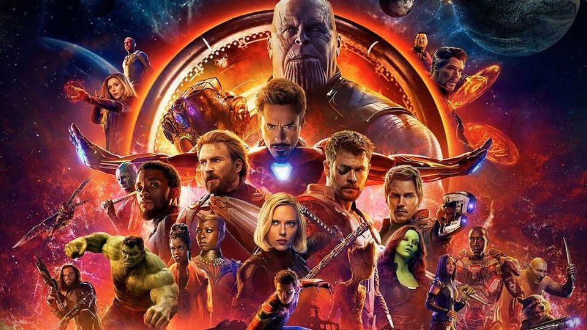

# Projeto final C125

## Descrição
Este projeto tem como objeto convencer aqueles que ainda não gostam dos filmes da Marvel, começarem a gostar.
Ele foi baseado no filme Vingadores Guerra Infinita onde os vingadores lutam contra o vilão Thanos tentando capturar as jóias do infinito.
Os vingadores não tem sucesso e acabam sendo derrotados, porém em Vingadores Ultimato eles dão uma reviravolta incrível e conseguem vencer Thanos.

  

## Critérios
Foram feitas algumas aplicações no projeto com base na ementa curricular de C125 como:
- Classes;
- Herança;
- Polimorfirmos;
- Classes Abstratas;
- Tratamento de erros;
- Leitura e escrita de arquivos;
- Maven;
- Teste de Unidade;

## Funcionalidades
- O código mostra todas as características dos vingadores e do vilão;
- Encena uma luta e imprime tudo no console;
- O arquivo txt é onde irá ficar registrado os motivos pelo qual todos devem começar a gostar dos filmes da Marvel;

